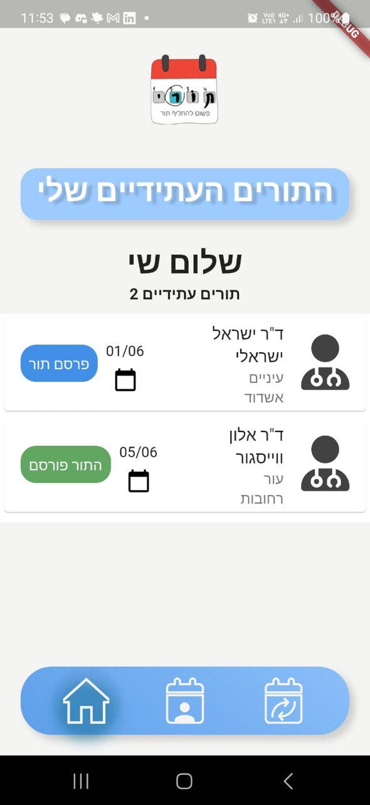
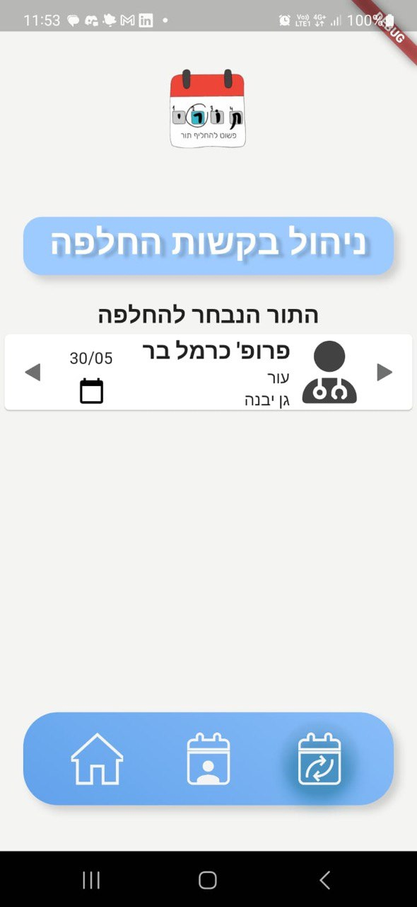
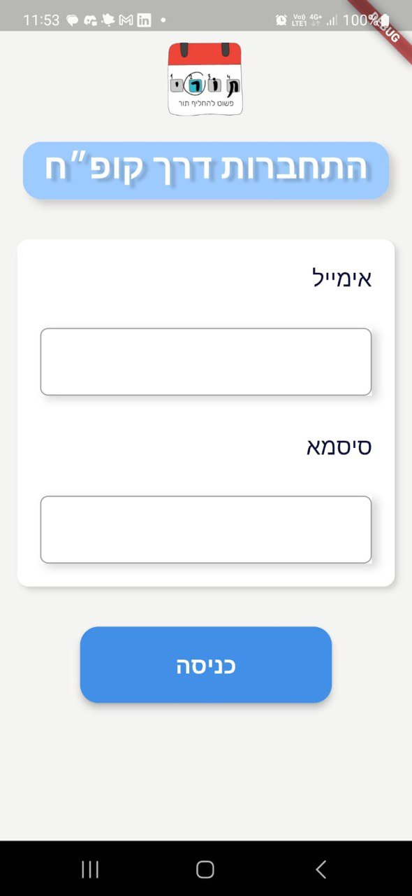

  

 
<i>Application for exchanging medical appointments using <a href="https://flutter.dev/">Flutter 💕</a> & <a href="https://firebase.google.com/">Firebase 🔥</a>  </i>
  
  
## About the App 🏥

  - Tori is an application used as a database of medical appointments 🤤!
  
  - Login or SignUp (P.S. Your credentials are safe!) 🤩 and this will lead you to your medical appointments.
  
  - You can post an appointment as replaceable or request an appointment that has already been posted 😍.
  
  - All the data is stored in Firebase. 😷.
  
## Screens 😍

  

## In Action 👀

  

