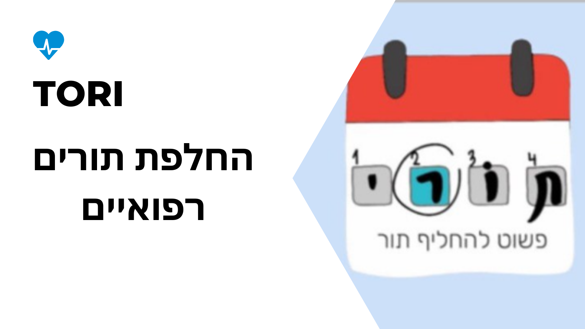

  

 
<i>A Study App using <a href="https://flutter.dev/">Flutter 💕</a> & <a href="https://firebase.google.com/">Firebase 🔥</a>  </i>
  
  
## About the App 🧠

  - Brain Boost is a App to view summaries and optimize learning with tracking if you want 🤤!
  
  - Login or SignUp using any account (P.S. Your credentials are safe!) 🤩 and this will lead you to the feed page.
  
  - You can also check tasks as done 😎 and you can view the pdf files wherever you want 😍.
  
  - All the data is stored in Firebase 🔥. Because of real-time database you'll get the latest summaries 🧠.
  
  - Future development 🥳 :downloading files and notes screen 🤗.
  
## Screens 😍

  

## In Action 👀

  

